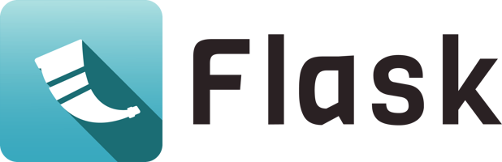

# 
 FlaskBlog App 

Flask is a <b>Python web framework</b> that provides configuration, conventions, and extensions to get started with web development.

It is classified as a <b>microframework</b> because it does not require particular tools or libraries. Flask’s framework is more explicit than Django’s framework and is also easier to learn because it has less base code to implement a simple web application.

Flask depends on the <b>Werkzeug WSGI toolkit, the Jinja template engine, and the Click CLI toolkit.</b>

<b><i>Link To Flask Documentation : </i></b><a href="https://flask.palletsprojects.com/en/3.0.x/">Flask</a>

## Technologies Used
* Flask
* HTML
* CSS

## ScreenShots

 
 

 
 

